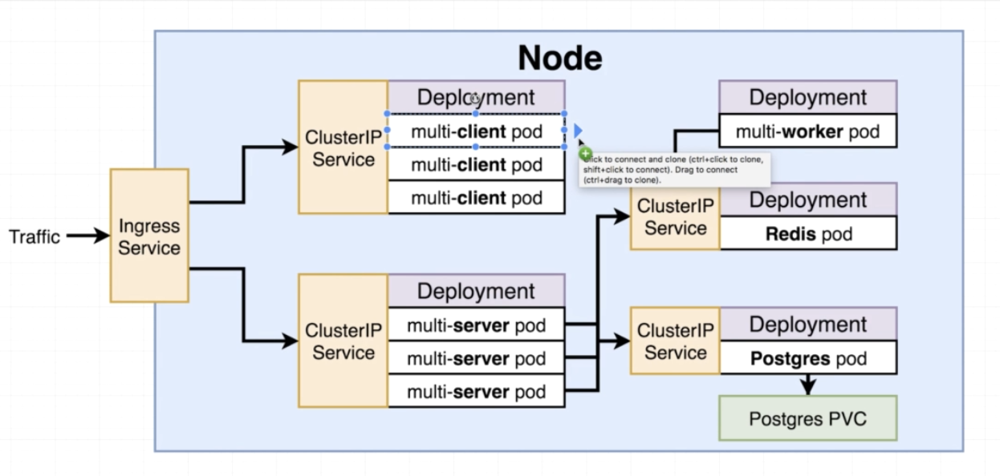
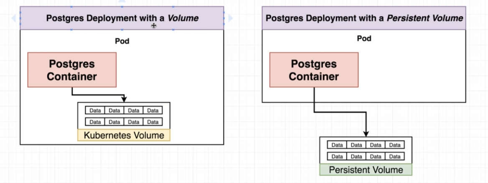
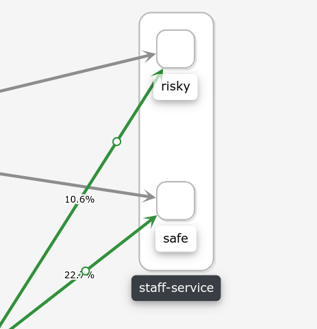
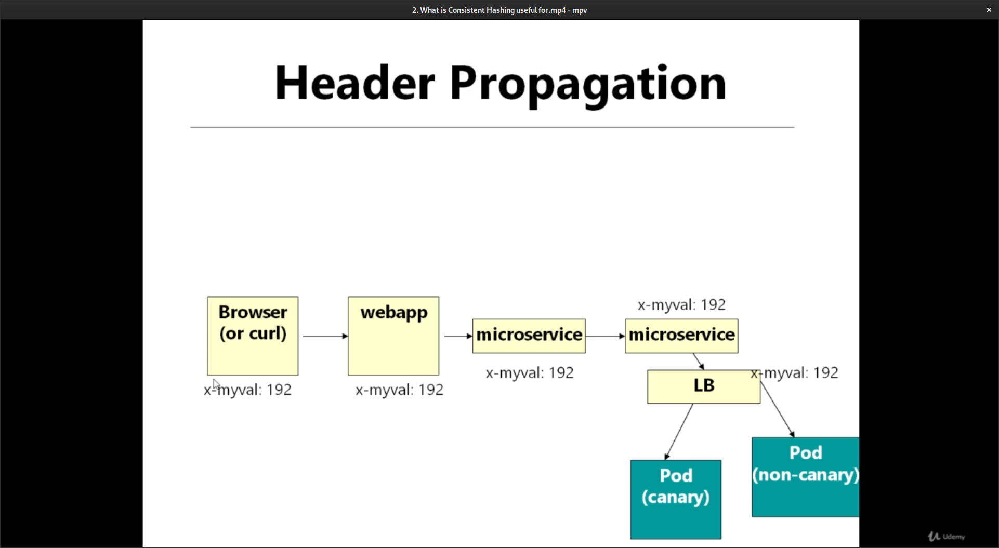
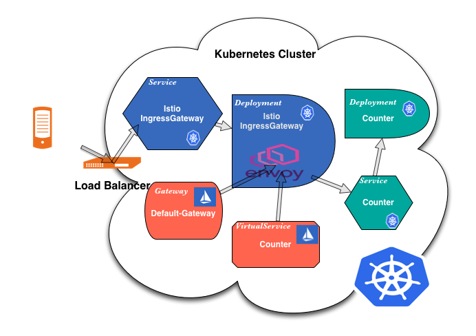

# Docker

## Why use docker

Briefly, because it makes it really easy to install and run software without worrying about setup or dependencies.

## What is docker

Docker is a platform or ecosystem contains a bunch of tools(e.g. Docker Client, Docker Server, Docker Machine, Docker Images, Docker Hub, Docker Compose) that comes together to creating and running containers.

### What's the container

Briefly, when we run `docker run sth` this is what happening : Docker Cli reach to something named Docker Hub and download the **Image** contains the a bunch of configuration and dependencies to install and running a very specific program _the images file will store on hard drive_ and on some point of time you can use this image to create a container, so the container is an instance of image a we can look at as an running program, in other word a container is a program with it's own set of hardware resources that have it's own little space of memory it's own little space of networking and it's own little space of hard drive as well.

## Docker for windows/mac

Contains:

- Docker Client (Docker CLI)
  Tool that we are going to issue commands to
- Docker Server (Docker Daemon)
  Tool that is responsible for creating images, running containers and etc

## Installing Docker Engine - Community and Docker-Compose

If you wish, Docker can also be installed on many different types of Linux distributions. This note covers how to install with Ubuntu, but the Docker docs have instructions for CentOS, Debian and Fedora as well.

Installation

_Note_: These steps were successfully completed with Ubuntu Desktop 18 LTS

_Note_: Linux mint 19.2 gotcha on adding repo:
Malformed input, repository not added.I fixed by just removing the [arch=amd64] from the source.

> sudo add-apt-repository "deb https://download.docker.com/linux/ubuntu bionic stable"

The docs for Ubuntu installation suggest setting up a Docker repository to install and update from.

This is where you should start:

https://docs.docker.com/install/linux/docker-ce/ubuntu/#set-up-the-repository

After completing the installation steps, test out Docker:

sudo docker run hello-world

This should download and run the test container printing "hello world" to your console.

Installing Docker Compose

Unlike the Mac and Windows Docker Desktop versions, we must manually install Docker Compose. See the instructions for the installation steps (Click on the tab for Linux)

https://docs.docker.com/compose/install/#install-compose

After completing, test your installation:

docker-compose -v

This should print the version and build numbers to your console.

Run without Sudo

Follow these instructions to run Docker commands without sudo:

https://docs.docker.com/install/linux/linux-postinstall/#manage-docker-as-a-non-root-user

The docker group will likely already be created, but you still need to add your user to this group.

Start on Boot

Follow these instructions so that Docker and its services start automatically on boot:

https://docs.docker.com/install/linux/linux-postinstall/#configure-docker-to-start-on-boot

You may need to restart your system before starting the course material.

## Using the docker client

> docker run hello-world

What just happened when we run this command:

1. we run the command `docker run hello-world` on docker cli (that mean we gonna run a container with an image named hello-world)
2. docker cli issue to docker daemon (server)
3. docker daemon check to see if we have a local copy of hello-world image on some thing called **Image Cache**
4. if hello-world image does not exist on image cache docker daemon will reach out to some free service named **Docker Hub** (the repository of free images that we can download an install)
5. docker daemon will download hello-world image and store it on image cache _then we can install and rerun it later without reaching to docker hub_
6. then docker server took that single file, load it on the memory to create a container of it run the program inside of it
7. then hello-world program will run in the container and it's whole purpose is to print some text on the terminal

## Manipulating docker cli

### Create and running a container from an image

> docker run hello-world

running and starting on the background

> docker run -d busybox

Overriding default commands:

> docker run busybox ls

executing specified command in container

output:

```shell
.
..
.dockerenv
bin
dev
etc
home
proc
root
sys
tmp
usr
var
```

### List all running containers

> docker ps

List all the containers the have been created:

> docker ps --all

### Container life cycle

docker run = docker create + docker start

creating a container:

> docker create busy-box ls -a

create a container and return it's id:

```shell
bd9fb4cd2ae040fb9413be7368d7a693f8e83780f6dcde92a65d6f8570fc045089
```

> docker ps --all

output

```shell
CONTAINER ID        IMAGE               COMMAND             CREATED             STATUS              PORTS               NAMES
bd9fb4cd2ae0        busybox             "ls -a"             12 seconds ago      Created                                 exciting_hodgkin

```

container is in **Created** STATUS

start the container with a watcher attached to it's output to print out on the terminal

> docker start -a bd9fb4cd2ae040fb9413be7368d7a693f8e83780f6dcde92a65d6f8570fc045089

output:

```shell
.
..
.dockerenv
bin
dev
etc
home
proc
root
sys
tmp
usr
var
```

> docker ps --all

output

```shell
CONTAINER ID        IMAGE               COMMAND             CREATED             STATUS                     PORTS               NAMES
bd9fb4cd2ae0        busybox             "ls -a"             3 minutes ago       Exited (0) 7 seconds ago                       exciting_hodgkin

```

container is in **Exited** STATUS

### Removing containers

Remove all stopped containers, all dangling images, and all unused networks:

> docker system prune

You’ll be prompted to continue, use the `-f` or `--force` flag to bypass the prompt.

Remove by CONTAINER_ID(s):

> docker container rm CONTAINER_ID_1 CONTAINER_ID_2

Remove all stopped containers:

> docker container prune

### Removing images

List of images

> docker images --all

Remove by IMAGE_ID(s):

> docker image rm IMAGE_ID

### Retrieving log output

> docker logs CONTAINER_ID

### Stop / kill container

> docker stop CONTAINER_ID

> docker kill CONTAINER_ID

Recommended docker stop to stop a process it will automatically run docker kill command if container not stop after 10 sec

### Executing command in a running container

> docker run redis

This command will create container and then start redis-server into it

> docker ps

output:

```shell
CONTAINER ID        IMAGE               COMMAND                  CREATED             STATUS              PORTS               NAMES
c7c021ce2637        redis               "docker-entrypoint.s…"   6 minutes ago       Up 6 minutes        6379/tcp            stupefied_lamport
```

> docker exec -it c7c021ce2637 redis-cli

The `-it` flag makes the container to receive input; without specifying this flag the process will start but don't let us to issue the inputs

### The it flag purpose

Every processes (in docker container) that running on linux environment have three communication channel attach to it:
this channels is using to communicate information either into the process or out of the process:

- STDIN: Comminute information into the process
- STDOUT: Convey information that coming out of the process
- STDERR: Covey information out of the process that kinds of like errors

The `-it` flag is shorten of two separate`-i` and `-t` flag:

- -i flags mean when we run this command we are going to attach or terminal to the STDIN channel of running process
- -t briefly make the out come texts show pretty(indent and etc)

## Getting a command prompt in a container

> docker exec -it 4aec7087de55 sh

`sh` is some kind of command shell program like bash, zsh or ... that allow us to issue command on terminal. Traditionally a lots of containers that we are going to working with contains sh program

### Starting with a shell

> docker run -it busybox sh

## Building custom images through docker daemon

Here is the steps we gonna go through:

1.  setup Dockerfile: a plain text file that define how our **container** should behave in other word whats programs it contains and how it's behave when first startup
2.  pass the Dockerfile to dockerCli and dockerCli will pass to dockerDaemon
3.  dockerDaemon will look up to docker file and will create a **usable image** of it

### Building a Dockerfile

flow of creating a Dockerfile:

1. specify a base image
2. run some command to install additional programs
3. specify a command to run on container startup

./Dockerfile

```Dockerfile
# specify the base image
FROM alpine

# download and install additional programs
RUN apk add --update redis

# specify a command to run on container startup
CMD ["redis-server"]
```

### .dockerignore https://codefresh.io/docker-tutorial/not-ignore-dockerignore-2/

Helps to define the build context:

./.dockerignore

```
# ignore .git and .cache folders
.git
.cache

# ignore all *.class files in all folders, including build root
**/*.class

# ignore all markdown files (md) beside all README*.md other than README-secret.md
*.md
!README*.md
README-secret.md
```

> docker build .

> docker run ImageID

What's happening after running `docker build .` _dot( . ) is the build context of the container_

1. dockerCli will pass DockerFile to dockerDeamon
2. dockerDaemon look at the localCash to find the `base image` (in our case alpine) then either download it or using existing one
3. dockerDaemon will initialized the base image
4. when dockerDaemon is about to running the `RUN` command it will create a `intermediate container` from the base image (in our case alpine)
5. dockerDaemon will run the specified command into that intermediate container (in our case `apk add --update redis`) and take it file snapshot (the actual image or images that downloaded)
6. dockerDaemon removing the intermediate container
7. dockerDaemon will take the file snapshot and the starting command then make a temporary image of it

### tagging an Image

> docker build -t tajpouria/redis:latest .

> docker run tajpouria/redis

### Manual image generating with docker commit

> docker run -it alpine sh
> \#apk add --update redis

> docker commit -c '["redis-server"]' CONTAINER_ID

## Building a simple server with docker

./Dockerfile

```Dockerfile
# install node baseImage with alpine tag tie to it
FROM node:alpine

# specifying a working directory for application
WORKDIR /usr/simpleServer

# copy file(s) from [ path relative to building context ] to [ path into container relative to WORKDIR ]
COPY ./package.json ./

RUN npm i

# separating COPY command because we don't want to reinstall all the dependencies after changing to source files
COPY ./ ./

CMD ["npm", "start"]
```

### Container port mapping

> docker run -p 4000:8080 IMAGE_ID/NAME

That's mean anytime that a request comes to port 4000 of `my machine` redirect it to port 8080 `inside the container`

## Docker compose with multiple local containers

### Docker compose

docker-compose is a separate cli installed with docker, used to start up multiple docker containers at the same time, automates some of the long-winded arguments we were passing to `docker run`

### docker-compose.yml

`docker-compose.yml` contains all the options we'd normally pass to docker-cli

with this knowledge as an instance here is the containers we gonna create:

- redis-server: make it using redis image

- visits-server: make it using Dockerfile then connect it's port to local machine

./docker-compose.yml

```yml
# the version of docker-compose
version: "3"
# type of containers
services:
  redis-server:
    image: "redis" # use this image to build this container
  visits-server:
    build: . # build this container using Dockerfile in this directory
    ports:
      - "4000:8080" # map [local machine port]:[container port]
```

then we can us it connect our server to redis-container

./index.ts

```typescript
const redisClient = redis.createClient({
  host: "redis-server", // docker parse as an url
  port: 6379,
});
```

./Dockerfile

```Dockerfile
FROM node:alpine

WORKDIR /usr/visits-server

COPY ./package.json .

RUN npm i

COPY . .

CMD ["npm", "start"]

```

### docker-compose commands

- docker run myImage:

> docker-compose up

> docker-compose up -d

- docker build . & docker run myImage **use when make change in images**

> docker-compose up --build

- docker stop CONTAINER_ID

> docker-compose down

- docker ps
  > docker-compose ps

### Container maintenance with compose

### Restart policies

- **"no"**`( default )`: never attempts to restart this . container if it stops or crashes

- **always**: if this container stops `always` attempt to restart it

- **on-failure**: only restart the container stops with an `error code`

- **unless-stopped**: always restart unless we forcibly stop it _on cli_

_just "no" have quote in yml files no will interpreted as false_

./docker-compose.yml

```yml
version: "3"
services:
  visits-server:
    restart: always
```

## A productions grade workflow

[Following description project repository](https://github.com/tajpouria/Docker-Travis-Test)

The process of development, testing and deployment and eventually on some point of time doing some additional development, additional testing and redeploy the application

### A development image

./Dockerfile.dev

```Dockerfile
FROM node:alpine

WORKDIR /usr/react-app

COPY ./package.json .

RUN npm i

COPY . .

CMD ["npm", "run", "start"]
```

build Dockerfile with custom name using `-f` flag:

> docker build -f Dockerfile .

### Docker volumes

With a dockerVolume we essentially setup some placeholder of sorts inside our container and instead of copy files we reference that file to the actual container in other word we mapping a folder inside a container to a folder outside a container

using `-v` flag you can either bookmark a file or map it, for example in following command:

_in following make sure the paths are absolute_

> docker run -p 3000:8080 -v /usr/react-app/node_modules/ -v \$(pwd):/usr/react-app/ IMAGE_ID

- node_modules `book marked` means do not map this file with an external file
- and other files in **present working directory(pwd)** are mapped(referenced) to external files and folders

### Shorthand with docker-compose

./docker-compose.yml

_the paths has to absolute_

```yml
version: "3"
services:
  react-app:
    build: # specify costume named docker file to build
      context: .
      dockerfile: Dockerfile.dev # SUPER IMPORTAND docker file paht relative context
    ports:
      - "3000:8080"
    volumes:
      - "/usr/rect-app/node_modules" # bookmark
      - ".:/usr/react-app" # reference
```

### Live updating tests

Here is two diffrend approach to run our tests

- attach the running container:

> docker exec -it IMAGE_ID npm run test

- docker-compose

```yml
version: "3"
services:
  # rect-app ...
  tests:
    build:
      context: .
      dockerfile: Dockerfile.dev
    volumes:
      - "usr/react-app/node_modules"
      - ".:/usr/rect-app"
    command: ["npm", "run", "test"] # overriding startup command
```

is it any way to interact with test service:

after running sh on container that is network between react-app and tests:

- > \# ps

output:

```shell
PID   USER     TIME  COMMAND
    1 root      0:00 npm
   17 root      0:00 node /usr/react-app/node_modules/.bin/react-scripts start
   24 root      0:05 node /usr/react-app/node_modules/react-scripts/scripts/start.js
  130 root      0:00 sh
  136 root      0:00 ps

```

as you see the primary process that is going on in this container with PID 1, but the problem is after running `docker attach CONTAINER_ID` it will automatically attach to primary process but for interacting to tests process we need to connect to start.js with PID of 24

### A production image

### Multi-step docker process

Using this feature when we're gonna have multi blocks of configuration for instance in our application we're gonna have two block of configuration:

1. build phase purpose:

- using node:alpine
- copy package.json
- install dependencies
- run npm run build

2. run phase purpose:

- use nginx
- copy over the results of npm run build **(essentially all the we copy the build folder and the other stuff like(node:alpine, node_modules and etc) drop from the result container)**
- start nginx

./Dockerfile

```Dockerfile
# tag the stage as builder
FROM node:alpine as builder
WORKDIR /usr/react-app
COPY ./package.json .
RUN npm i
COPY . .
RUN npm run build
# the build folder we create at usr/react-app

FROM nginx
# putting EXPOSE 80 like this do nothing automatically in most environment (e.g. development environment) and is some kind of communication of sorts between developers to understand it container needs to some port mapped to port 80 but aws elastic beans talks will look for this EXPOSE and mapped it automatically
EXPOSE 80
# copy build folder from builder stage into user/share/nginx/html and nginx will automatically serve it when startup
COPY --from=builder /usr/react-app/build usr/share/nginx/html
# nginx will automatically set start command
```

> docker build .

_nginx default port is `80`_

> docker run -p 8080:80 CONTAINER_ID

## Continues integration

### Travis yml file configuration

Here is the steps we're gonna put in this file

- tell the travis we need a copy of docker running to build the project and running the tests suits
- build the project using the Dockerfile.dev (cuz the our Dockerfile not contains dependencies to run tests)
- tell the travis how to run the test suits
- tell the travis how to deploy our project over to aws

.travis.yml

```yml
# any time we use the docker we need to have super user permission
sudo: required

# we need a copy of docker
services:
  - docker

# gonna have a series of different command that get executed before another process (in our case before the tests run)
before_install:
  - docker build -t tajpouria/docker-travis-test -f dockerfile.dev .
# commands to run our tests suits
# travis CI is gonna watch out the output of each of this command: if one of the scripts return exit with status code except 0 the travis gonna assume that the test suit is actually failed and our code is essentially broken
# *** default behavior of npm run test is to hangout with output and not exit automatically so the travis will never gonna receive the exit status code we can exit the test after running it by specifying -- --watchAll=false flag
script:
  - docker run tajpouria/docker-travis-test npm run test -- --watchAll=false

deploy:
  provider: elasticbeanstalk
  region: "us-east-1"
  app: "react-docker"
  env: "Docker-env"
  bucket_name: "elasticbeanstalk-us-east-1-746123612876210"
  bucket_path: "react-docker"
  on:
    branch: master
  access_key_id: $AWS_ACCESS_KEY
  secret_access_key:
    secure: "$AWS_SECURE_KEY"
```

## A Multi Container Application

[Following description project repository **/branch master**](https://github.com/tajpouria/Docker-Multiple-Container-Test/tree/master)

### docker-compose environment variables

this is gonna set up a variable inside the container at **run-time** of the container:

- `variableName=value`
- `variableName` the value is taken from machine

docker-compose.yml

```yml
version: "3"
services:
  postgres:
  restart: "always"
  build:
    dockerfile: Dockerfile.dev
    context: ./postgres
  environment:
    - "FILLA_DB_USER=docker"
    - "FILLA_DB_PASSWORD=postgres_password"
    - "FILLA_DB_DATABASE=multi_docker"
  redis:
    image: "redis:latest"
  nginx:
    restart: always
    build:
      dockerfile: dockerfile.dev
      context: ./nginx
    ports:
      - "3000:80"
  api:
    build:
      dockerfile: Dockerfile.dev
      context: ./api # it will find Dockerfile.dev into this context
    volumes:
      - usr/app/node_modules
      - ./api :usr/app # *** make sure to specify each volume to related folder
    environment: # specify environment variables
      - REDIS_HOST=redis
      - REDIS_PORT=6379
      - PGUSER=docker
      - PGHOST=postgres
      - PGDATABASE=multi_docker
      - PGPASSWORD=postgres_password
      - PGPORT=5432
  client:
    build:
      dockerfile: Dockerfile.dev
      context: ./client
    volumes:
      - usr/app/node_modules
      - ./client:usr/app
  worker:
    build:
      dockerfile: Dockerfile.dev
      context: ./worker
    volumes:
      - usr/app/node_modules
      - ./worker:usr/worker
```

### Postgres create init database

./postgres/init/01-filladb.sh

```shell
#!/bin/bash

# Immediately exits if any error occurs during the script
# execution. If not set, an error could occur and the
# script would continue its execution.
set -o errexit


# Creating an array that defines the environment variables
# that must be set. This can be consumed later via arrray
# variable expansion ${REQUIRED_ENV_VARS[@]}.
readonly REQUIRED_ENV_VARS=(
  "FILLA_DB_USER"
  "FILLA_DB_PASSWORD"
  "FILLA_DB_DATABASE"
  "POSTGRES_USER")


# Main execution:
# - verifies if all environment variables are set
# - runs the SQL code to create user and database
main() {
  check_env_vars_set
  init_user_and_db
}


# Checks if all of the required environment
# variables are set. If one of them isn't,
# echoes a text explaining which one isn't
# and the name of the ones that need to be
check_env_vars_set() {
  for required_env_var in ${REQUIRED_ENV_VARS[@]}; do
    if [[ -z "${!required_env_var}" ]]; then
      echo "Error:
    Environment variable '$required_env_var' not set.
    Make sure you have the following environment variables set:
      ${REQUIRED_ENV_VARS[@]}
Aborting."
      exit 1
    fi
  done
}


# Performs the initialization in the already-started PostgreSQL
# using the preconfigured POSTGRE_USER user.
init_user_and_db() {
  psql -v ON_ERROR_STOP=1 --username "$POSTGRES_USER" <<-EOSQL
     CREATE USER $FILLA_DB_USER WITH PASSWORD '$FILLA_DB_PASSWORD';
     CREATE DATABASE $FILLA_DB_DATABASE;
     GRANT ALL PRIVILEGES ON DATABASE $FILLA_DB_DATABASE TO $FILLA_DB_USER;
EOSQL
}

# Executes the main routine with environment variables
# passed through the command line. We don't use them in
# this script but now you know 🤓
main "$@"
```

./postgres/Dockerfile.dev

```Dockerfile
FROM postgres:alpine

ADD ./init /docker-entrypoint-initdb.d/
```

### Nginx path routing

#### default.conf

In order to setup nginx in the application to route the request off the appropriate backend we're gonna create a file called `default.conf`, this is a very special file to we're gonna added to our nginx image this file is gonna add a little bit of configuration to implement this set of routing routes:

- tell nginx that is an 'upstream' server at client:3000 and server:5000
- listen on port 80
- if someone comes to '/' send them to client upstream
- if someone comes to '/api' send them to server upstream

./nginx/default.conf

```conf
upstream client {
    # notice ;
    server client:3000;
}

upstream api{
    server api:5000;
}

server {
    listen 80;

    location / {
        proxy_pass http://client;
    }

    # react dev server request not handled WebSocket connection to ws Error
    location /sockjs-node {
        proxy_pass http://client;
        proxy_http_version 1.1;
        proxy_set_header Upgrade $http_upgrade;
        proxy_set_header Connection "Upgrade";
    }

    location /api {
        # rewrite will remove /api/ from request
        rewrite /api/(.*) /$1 break;
        proxy_pass http://api;
    }
}
```

#### Build a custom nginx image from

./nginx/Dockerfile.dev

```dockerfile
FROM nginx

# override the default.conf
COPY ./default.conf /etc/nginx/conf.d/default.conf
```

### A continuous integration and deployment workflow for multiple images

- push code to git repository (in this case github)
- travis automatically pulls the codes
- travis builds a test image, test code
- travis builds a production image
- travis pushes built production image to docker hub
- travis push project to AWS EB
- AWS EB pulls images from docker hun, deploys

### Nginx on client

./client/nginx/default.conf

```conf
server {
    listen 3000;

    location / {
        root /usr/share/nginx/html; # /usr
        index index.html index.htm;
        try_file $url $url/ /index.html; # *** make nginx works correctly with react-router *** for some reason this line have an issue with k8s pod configuration so i deleted this line on tajpouria/multi-client:v3
    }
}
```

./client/Dockerfile

```Dockerfile
FROM node:alpine as builder
WORKDIR /usr/app
COPY ./package.json .
RUN npm i
COPY . .
RUN npm run build

FROM nginx
EXPOSE 3000
COPY ./nginx/default.conf /etc/nginx/conf.d/default.conf
COPY --from=builder /usr/app/build /usr/share/nginx/html
```

### Pushing image to docker hub

- login to docker

  > docker login

- push an image to docker hub

  > docker push IMAGE_ID/TAG

```yml
sudo: required
services:
  - docker
before_install:
  - docker build -t tajpouria/react-app -f ./client/Dockerfile.dev ./client # *** make sure to specify client directly as build context
script:
  - docker run tajpouria/react-app npm run test -- --coverage

after_success:
  - docker build -t tajpouria/multi-nginx ./nginx
  - docker build -t tajpouria/multi-postgres ./postgres
  - docker build -t tajpouria/multi-worker ./worker
  - docker build -t tajpouria/multi-server ./server
  - docker build -t tajpouria/multi-client ./client
  # login to docker-cli (using travis environment variables)
  # retrieve the docker password from environment variable and essentially emit that as input to the next command stdin channel
  - echo "$DOCKER_PASSWORD" | docker login -u "$DOCKER_ID" --password-stdin
  # take those images and push them to docker hub
  - docker push tajpouria/multi-nginx
  - docker push tajpouria/multi-postgres
  - docker push tajpouria/multi-worker
  - docker push tajpouria/multi-server
  - docker push tajpouria/multi-client
```

# Kubernetes

## Why use kubernetes

If we were use kubernetes we can have additional machines running containers and we could had a lot of control over whats these additional machines were doing or what container they were running

### Kubernetes cluster

A **cluster** in world of kubernetes is an assembly of **master** and one or more **nodes**

- a node is a virtual machine or a physical computer that use to run some number of different containers
- in world of kubernetes are these nodes that have been created is manged by something named master, master contains a sets of program on it that control what each of these nodes is running at any given time

#### Kubernetes is a system for running many different containers over multiple different machines and used when you need to run many different containers with different images

### Kubernetes in development and production

For running kubernetes in development environment we using a program called **minikube**

- minikube is a command line tool and it's purpose is to setup tiny cluster on your local machine

when we start using kubernetes on production environment we very frequently use what are called **manage solutions**

- managed solutions are referenced to outside cloud provides such as Amazon Elastic Container Service for Kubernetes (EKS), Google Cloud Kubernetes Engine (GKS) and etc, that will setup entire kubernetes cluster for you

- in order to interact with this cluster we're going to use a program name **kubectl**

## Installing

These instructions were tested on a laptop with the desktop version of Linux Mint 19 Cinnamon installed. Current Ubuntu desktop version's setup should be the same. Your experience may vary if using an RHEL / Arch / Other distribution or non desktop distribution like Ubuntu server, or lightweight distributions which may omit many expected tools.

- Install VirtualBox:

Find your Linux distribution and download the .deb package, using a graphical installer here should be sufficient. If you use a package manager like apt to install from your terminal, you will likely get a fairly out of date version.

https://www.virtualbox.org/wiki/Linux_Downloads

After installing, check your installation to make sure it worked:

> VBoxManage —version

**For some reason Virtual box not worker for me and I used KVM instead:**

- Install KVM:

https://help.ubuntu.com/community/KVM/Installation :

> sudo apt-get install qemu-kvm libvirt-daemon-system libvirt-clients bridge-utils

https://askubuntu.com/questions/1050621/kvm-is-required-to-run-this-avd :

> sudo adduser \$USER kvm

https://minikube.sigs.k8s.io/docs/reference/drivers/kvm2/ :

> virt-host-validate

**Make sure no test failed**

> minikube start --vm-driver=kvm2

As an alternative you can use (or maybe you have to use) KVM instead of VirtualBox. Here are some great instructions that can be found in this post (Thanks to Nick L. for sharing):

https://computingforgeeks.com/install-kvm-centos-rhel-ubuntu-debian-sles-arch/

- Install Kubectl

In your terminal run the following:

> curl -LO https://storage.googleapis.com/kubernetes-release/release/`curl -s https://storage.googleapis.com/kubernetes-release/release/stable.txt`/bin/linux/amd64/kubectl

> sudo mv ./kubectl /usr/local/bin/kubectl

Check your Installation:

> kubectl version

See also official docs:
https://kubernetes.io/docs/tasks/tools/install-kubectl/#install-kubectl-on-linux

- Install Minikube

In your terminal run the following:

> curl -Lo minikube https://storage.googleapis.com/minikube/releases/latest/minikube-linux-amd64 && chmod +x minikube

> sudo install minikube /usr/local/bin

Check your installation:

minikube version

- Start Minikube:

https://github.com/kubernetes/minikube/issues/2412 :

> minikube delete

> minikube start

> minikube start --memory 4096 # Start with 4 G of ram

> minikube dashboard

in order to stop VM

> minikube stop

See also official docs:

https://kubernetes.io/docs/tasks/tools/install-minikube/

- Gets the status of a local kubernetes cluster:

> minikube status

- display cluster info

> kubectl cluster-info

- VM ip

> minikube ip

### Mapping existing knowledge

|                         docker-compose                         |                    kubernetes                    | get a simple container running on our local kubernetes cluster running |
| :------------------------------------------------------------: | :----------------------------------------------: | :--------------------------------------------------------------------: |
| Each entry can optionally get docker-compose to build an image | Kubernetes expect all images to already be built |              Make sure our images is hosted on docker hub              |
|       Each entry represent a container we want to create       |  One config file per _object_ we want ot create  |              Make one config file to create the container              |
|     Each entry defines the networking requirements (ports)     |    We have to manually set up all networking     |               Make one config file to set up networking                |

### Adding configuration

#### terminology

**Config file describe the containers(or objects in k8s) we want**

the **object** in k8s world is a thing!! that will create in our cluster to make it behave the way we expect

- Pod: After we run `minikube start` it will create a virtual machine on computer we refer to that machine as a **node** we'll use this node to run different objects, one of this most basic object that we gonna create is refer as a **Pod**, a pod essentially is a grouping of very **closely**Jjk related container(s) with a very common purpose

- Service : we `Service` object type we we're gonna set up networking in a k8s cluster

- NodePort: is a **sub object type of Service object type** every time a request coming to **kubeProxy**(the single window to communicate to world outside of the node) then it will reach the nodePort and nodePort will link it to a container inside a Pod _nodePort is only uses for development purposes_

./simplek8s/client-pod.yml

```yml
apiVersion: v1 # Each API version defines a different set of object we can use
kind: Pod # Specify the object type we want to create, object serve different purpose for e.g. Pod: running a container, Service: networking
metadata:
  name: client-pod # the name of pod that get created
  labels:
    component: web # label that Pod to be able to select that from Service
spec:
  containers:
    - name: client
    image: tajpouria/multi-client
      ports:
      - containerPort: 3000 # on this container we want to expose port 3000 to the outside world
```

./simplek8s/client-node-port.yml

```yml
apiVersion: v1
kind: Service
metadata:
  name: client-node-port
spec:
  type: NodePort # exposes a container to the outside world(only good for development purposes)
  ports:
    - port: 3000 # the port that other Pod in our cluster can access to this Pod targetPort: 3000 # the port inside this Pod that we going open up traffic to nodePort: 31515 # the port we're going to use outside the node (in browser) in order to access to access the Pod ***(default: random number between 30000 and 32767)
       selector:
    component: web # select web pod by it's label
```

- Feed the config file to kubctl

> kubectl apply -f \<path to the file or the folder contains all config files\>

- Retrieve information about a running object

> kubectl get \<object name\>

e.g. print the status of all running pods

> kubectl get pods

e.g. print the status of all services

> kubectl get services

e.g. print the status of all persistent volumes

> kubectl get pv

e.g. print the status of all persistent volumes claims

> kubectl get pvc

e.g. print secrets

> kubectl get secrets

- Show description of a specific resource or group of resource

> kubectl describe \<object type\> \<object name\>

e.g a pod description

> kubectl describe client-pod

- Delete an object

1.  delete by config file
    > kubectl delete -f \<path to the file that used to create that object \>
        e.g delete the client-pod
    > kubectl delete client-pod.yml
2.  delete by object type
    > kubectl delete deployment client-deployment

- Get Pod logs

> kubectl logs \<Pod name\>

- get all the different options that k8s has to create a persistent volume

> kubectl get storageclass

#### After applying Pod and nodePort configuration the node is available on NODE_IP:nodePort:

NODE_IP:

> minikube ip

nodePort: 31515

### the entire deployment workflow

- When we run `kubectl apply -f <filename>` the file is taken and pass into master
- On the master kube-apiServer will read configuration file and interpret it in some fashion
- kube-apiServer will update the cluster status based upon of configuration file and node(s) status
- kube-apiServer will tell node(s) that which container and how much copy of it should run
- each node have a copy of docker into it and it will use it to reach into docker hub to create container(s) of it
- kube-apiServer will update the status

## Maintaining sets of container with deployment

### Pods downwards

With the Pods configured as container wrapper there is just a few fields available that we can changed and maintain:

| Pod Configuration | Able to change |
| :---------------: | :------------: |
|    containers     |       no       |
|       name        |       no       |
|       ports       |       no       |
|       image       |      yes       |

And this is kind of downward for Pods and because of this reason and some other reason Pods is only appropriate for development purposes

### Deployment

Deployment is a kind of object type that help us to:

- runs and manage a sets of identical Pods one or more
- monitoring the state of Pods and change it if it's necessary
- is appropriate of both development and production

./simplek8s/client-deployment.yml

```yml
apiVersion: apps/v1
kind: Deployment
metadata:
  name: client-deployment
spec:
  replicas: 1 # the number of Pods that this Deployment is going to create
  selector: # uses by Deployment to handle over Pods after it's has been created
    matchLabels:
      component: web
  template: # configuration of every single Pod that will created by this deployment
    metadata:
      labels:
        component: web
    spec:
      containers:
        - name: client
          image: tajpouria/multi-client
          ports:
            - containerPort: 3000
```

_delete client-pod_

> kubectl delete -f client-pod.yml

> kubectl apply -f client-deployment.yml

### Update image version

Here's the steps we going through:

- Tag the image with a version number and push it to docker hub
- Run the kubectl command that forcing that deployment to use new the new image version:

> kubectl set image \<object type\>/\<object name\> \<container name\>=\<new image to use\>

e.g.

> kubectl set image Deployment/client-deployment client=tajpouria/multi-client:v2

### Configure the VM machine to use your dockerServer

In order to access the **dockerServer instance on VM(node)** from your **current terminal** window use following command:

> eval \$(minikube docker-env)

_this command exports a sets of env-variables that uses by docker to decide which containers it should try to connect to_

**this configuration only works on your current terminal window**

## A multi container Application with k8s

[Following description project repository **/branch k8s**](https://github.com/tajpouria/Docker-Multiple-Container-Test/tree/k8s)



### NodePort vs ClusterIP

In world of k8s we use services to setup networking in a cluster; NodePort and ClusterIP are both kind of services **NodePort** is uses whenever we going to setup networking between a Pod and **outside world** however **ClusterIP** is using for setup networking between a Pod and **other cluster objects**

### ClusterIp Service

./k8s/client-cluster-ip-service.yml

```yml
apiVersion: v1
kind: Service
metadata:
  name: client-cluster-ip-services
spec:
  type: ClusterIP
  selector:
    component: web
    ports:
      - port: 3000 # other objects can access this ClusterIP through this port
        targetPort: 3000 # Pod port
```

### Combining multiple config file into one

./k8s/api-config.yml

```yml
apiVersion: apps/v1
kind: Deployment
metadata:
  name: api-deployment
spec:
  replicas: 3
  selector:
    matchLabels:
      component: api
  template:
    metadata:
      labels:
        component: api
    spec:
      containers:
        - name: api
          image: tajpouria/multi-api
          ports:
            - containerPort: 5000
--- # *** separate each config file with 3 dashes
apiVersion: v1
kind: Service
metadata:
  name: api-cluster-ip-services
spec:
  type: ClusterIP
  selector:
    component: api
  ports:
    - port: 5000
      targetPort: 5000
```

### K8s persistence volume claim

K8s volumes is about how to persisting data outside of a container because that data is something that we care about and we want to persisted across the restarts or terminations of a given container

#### The word Volumes in world of k8s is an Object that essentially allows a container to persistent data at the Pod level

#### In this section we're not gonna use k8s's Volumes we want use pe Persistent Volume Claim and Persistent Volume

### K8s's Volumes vs PersistentVolume



### Persistent Volume Claim (PVC) vs Persistent Volume (PV)

The **Persistent Volume Claim is an advertizement of options** we can ask for one those options inside our Pod config then k8s is going to look the existing store of **Persistent Volume** and it's going to either give you a volume that's been created ahead of time or attempt to create one on the fly

### terminology

- accessMods:
  1. ReadWriteOnce: can read and write by a single node at a time
  2. ReadWriteMany: can read by multiple node at the same time
  3. ReadOnlyMany: can read and write by multiple node at the same time

./k8s/database-persistent-volume-claim.yml

```yml
apiVersion: v1
kind: PersistentVolumeClaim
metadata:
  name: database-persistent-volume-claim
spec:
  accessMods:
    - ReadWriteOnce
  resources:
    requests:
      storage: 2gi
```

### Designing a PVC in Pod Template

./k8s/postgres-deployment.yml

```yml
apiVersion: apps/v1
kind: Deployment
metadata:
  name: postgres-deployment
spec:
  replicas: 1
  selector:
    matchLabels:
      component: postgres
  template:
    metadata:
      labels:
        component: postgres
    spec:
      volumes: # allocate the storage
        - name: postgres-storage
          persistentVolumeClaim:
            claimName: database-persistent-volume-claim # name of created PV on node
      containers:
        - name: postgres
          image: tajpouria/multi-postgres
          ports:
            - containerPort: 5432
          volumeMounts: # using the storage
            - name: postgres-storage # the name of storage
              mountPath: /var/lib/postgresql/data # store this path (in this case postgres default data storing path)
              subPath: postgres # sore the data inside a folder name postgres on the actual PV (postgres needs that!!)
          env:
            - name: PGPASSWORD # postgres will use this password (PGPASSWORD) as default password
              valueFrom:
                secretKeyRef:
                  name: pgpassword
                  key: PGPASSWORd
```

### Environment variables in k8s

Securely stores a piece of information in the cluster, such as a database password

> kubectl create secret generic \<secret_name\> --from-literal key=value

e.g.

> kubectl create secret generic pgpassword --from-literal PGPASSWORD=1234asdf

#### Constant variables

```yml
apiVersion: apps/v1
kind: Deployment
metadata:
  name: api-deployment
spec:
  replicas: 3
  selector:
    matchLabels:
      component: api
  template:
    metadata:
      labels:
        component: api
    spec:
      containers:
        - name: api
          image: tajpouria/multi-api
          ports:
            - containerPort: 5000
          env: # environment variables
            - name: REDISHOST
              value: redis-cluster-ip-service # *** once you needs other pods set pods_name as URL
            - name: REDISPORT
              value: "5432" # make sure pass string (Error: cannot convert int64 into sting!)
            - name: PGPASSWORD
              valueFrom: # getting the key from SecretObject
                secretKeyRef:
                  name: pgpassword # the name of the secret
                  key: PGPASSWORD # a secret can have multiple keys and we should specify which key we want
```

## Handling traffic with ingress controller

Ingress is a type of services that is going to give some amount of traffic into our application

**In this case we're gonna use a project name [ kubernetes/ingress-nginx ](https://github.com/kubernetes/ingress-nginx)**

### How ingress services created behind the scenes

- create a config file and pass to KubeCTL in order to create an ingress service
- KubeCTL will create an `object` inside of kubernetes called `controller`
- this object will compare current state and desired state
- then object will create a nginx Pod that have many particular rules that make sure the traffic that comes in will sent of to appropriate service

### Ingress-nginx installation guide https://kubernetes.github.io/ingress-nginx/deploy/

The following Mandatory Command is required for all deployments:

> kubectl apply -f https://raw.githubusercontent.com/kubernetes/ingress-nginx/master/deploy/static/mandatory.yaml

minikube:

> minikube addons enable ingress

### Configure ingress-service.yml

./k8s/ingress-service.yml

```yml
apiVersion: extensions/v1beta1
kind: Ingress
metadata:
  name: ingress-service
  annotations:
    kubernetes.io/ingress.class: nginx
    nginx.ingress.kubernetes.io/rewrite-target: /
spec:
  rules:
    - http:
        paths:
          - path: /
            backend:
              serviceName: client-cluster-ip-service
              servicePort: 3000
          - path: /api/
            backend:
              serviceName: server-cluster-ip-service
              servicePort: 5000
```

## Sundry

### Node process exit status codes

- 0: we exited and everything is OK
- 1, 2, 3, etc: we exited because something went wrong

### Redis

#### pub/sub

```typescript
const client = redis.createClient({
  host,
  key,
  retry_strategy: () => 1000, // if ever loses the connection it's automatically try to reconnect every one second
});

const sub = client.duplicate(); // Duplicate all current options and return a new redisClient instance, to send regular command to redis while in subscriber mode, just open another connection with a new client.
sub.on("message", (channel, message) => {
  redisClient.hset("values", message, "hello"); // sets field in the hash stored at key to value e.g redis-cli>HSET my hash field1 "hello" redis-cli>HGET hash field1
});
sub.subscribe("insert");

const publisher = client.duplicate();
publisher.publish("insert", index);
```

#### hgetall

Get the all values inside a hash

```typescript
redis.hgetall("values", (err, values) => values);
```

### travis

#### Safelisting or Blocklisting Branches

```yml
# blocklist
branches:
  except:
  - legacy
  - experimental

# safelist
branches:
  only:
  - master
  - stable
```

# Istio

An Istio service mesh is logically split into a data plane and a control plane.

The data plane is composed of a set of intelligent proxies (Envoy) deployed as sidecars. These proxies mediate and control all network communication between microservices. They also collect and report telemetry on all mesh traffic.

The control plane manages and configures the proxies to route traffic.


## Setup Istio control plane

### Warmup setup way: Using pre-generated K8s config

1. Setup Istio control plane

[istio-init.yaml](./isitio-fleetman/init-istio/istio-init.yaml): Initialize Istio custom resource definitions

> k apply -f istio-init.yaml

[istio-minikube.yaml](./isitio-fleetman/init-istio/istio-minikube.yaml): Create control plane components

> k apply -f istio-minikube.yaml

2. Setup kiali username and passprase secret

[kiali-secret.yml](./isitio-fleetman/init-istio/kiali-secret.yml)

> k apply -f kiali-secret.yml

3. Setup Istio data plane

There are multiple ways of doing this but here we will do it by setting a label on working namespace and let the istio to attach the sidecar proxies:

> k label namespace default istio-injection=enabled

> k describe ns default

```sh
Name:         default
Labels:       istio-injection=enabled
Annotations:  <none>
Status:       Active

No resource quota.

No LimitRange resource.
```

### Istio control plane components

- Galley: Reads K8s config (or other orchestration platform) and convert it in the internal format that istio understands.

- Pilot: Receive formmated configuarion and propagate it across the proxies

- Citadel: Managing TLS/SSL certifciates e.g. secure cominucation between proxies

### What is required for distributed tracing with Istio?(https://istio.io/latest/faq/distributed-tracing/#how-to-support-tracing)

The application needs to propagate the trace context. For example in case of an HTTP request you need to read tracing headers (**x-request-id**, x-b3-traceid, x-b3-spanid, x-b3-parentspanid, x-b3-sampled, x-b3-flags, b3) and send them alongside with the response.

As a side note, the `x-request-id` will be generated by sidecard proxies and attacted to the request if it's not exists.

### Traffic management

- Kiali uses `app` label in app graph and `version` label in version graph

```yml
metadata:
  labels:
    app: staff-service
    version: safe
---
metadata:
  labels:
    app: staff-service
    version: risky
```



### Istio virtual service

vs:

Virtual services enables us to configure custom routing to the service mesh.

Virtual services are managed by pilot and allows us to change the side-car proxies configuration in a dynamic fashion and manage the incoming traffic that way.

_Despite the name virtual services and services (K8s's services) aren't really related_

dr:

Defining which pod should be a part of each subset

## VS and DR configuration

```yaml
apiVersion: networking.istio.io/v1beta1
kind: VirtualService
metadata:
  name: fleetman-staff-service # "Just" a name for the virtual service
  namespace: default
spec:
  hosts:
    - fleetman-staff-service.default.svc.cluster.local # The service DNS (i.e the regular K8s service) name that we're applying routing rules to. (In this case the name of the cluster IP)
  http:
    - route:
        - destination:
            host: fleetman-staff-service.default.svc.cluster.local # The target service DNS name (In this case the name of the cluster IP)
            subset: safe # Pointing to the name that have been defined by destination rule
          weight: 0 # Should be integer and not floating point numbers
        - destination:
            host: fleetman-staff-service.default.svc.cluster.local # The target service DNS name
            subset: risky
          weight: 100 # Should be integer and not floating point number
---
apiVersion: networking.istio.io/v1beta1
kind: DestinationRule
metadata:
  name: fleetman-staff-service # "Just" a name for destination rule
  namespace: default
spec:
  host: fleetman-staff-service.default.svc.cluster.local # The target service DNS name (In this case the name of the cluster IP)
  trafficPolicy: ~
  subsets:
    - labels: # This is actually a pod SELECTOR
        version: safe # The target pod should have this label
      name: safe
    - labels: # This is actually a pod SELECTOR
        version: risky # The target pod should have this label
      name: risky
```

### Load balancing

### Session affinity (Sticky session) load balancing

In the following example we uses request header as input of consistent hashing load balancer.

```yml
apiVersion: networking.istio.io/v1beta1
kind: VirtualService
metadata:
  name: fleetman-staff-service
  namespace: default
spec:
  hosts:
    - fleetman-staff-service.default.svc.cluster.local
  http:
    - route:
        - destination:
            host: fleetman-staff-service.default.svc.cluster.local
            subset: all-staff-service
          weight: 100
---
apiVersion: networking.istio.io/v1beta1
kind: DestinationRule
metadata:
  name: fleetman-staff-service
  namespace: default
spec:
  host: fleetman-staff-service.default.svc.cluster.local
  trafficPolicy:
    loadBalancer:
      consistentHash:
        httpHeaderName: "x-myval"
  subsets:
    - labels:
        app: staff-service
      name: all-staff-service
```

**Keep in mind you need to propaget the target header in order to loadbalancer to works:**



**Sticky session load balancing and weighted routing will not works together. For example in following configuation that uses source IP as the input of consistent hashing algorithem, requets does not always ends up getting routed to a specific upstream:**

```yml
apiVersion: networking.istio.io/v1beta1
kind: VirtualService
metadata:
  name: fleetman-staff-service
  namespace: default
spec:
  hosts:
    - fleetman-staff-service.default.svc.cluster.local
  http:
    - route:
        - destination:
            host: fleetman-staff-service.default.svc.cluster.local
            subset: safe
          weight: 50
        - destination:
            host: fleetman-staff-service.default.svc.cluster.local
            subset: risky
          weight: 50
---
apiVersion: networking.istio.io/v1beta1
kind: DestinationRule
metadata:
  name: fleetman-staff-service
  namespace: default
spec:
  host: fleetman-staff-service.default.svc.cluster.local
  trafficPolicy:
    loadBalancer:
      consistentHash:
        useSourceIp: true
  subsets:
    - labels:
        version: safe
      name: safe
    - labels:
        version: risky
      name: risky
```

### Gateways

In Istio we're using Gateway instead of traditional Ingress. Here's how request routed to out the application using Istio gateways:

- A client makes a request on a specific port.
- The Load Balancer listens on this port and forwards the request to one of the workers in the cluster (on the same or a new port).
- Inside the cluster the request is routed to the Istio IngressGateway Service which is listening on the port the load balancer forwards to.
- The Service forwards the request (on the same or a new port) to an Istio IngressGateway Pod (managed by a Deployment).
- The IngressGateway Pod is configured by a Gateway (!) and a VirtualService.
- The Gateway configures the ports, protocol, and certificates.
- The VirtualService configures routing information to find the correct Service
- The Istio IngressGateway Pod routes the request to the application Service.
- And finally, the application Service routes the request to an application Pod (managed by a deployment).



Gateways will strictly will be used to configure Istio ingress gateway which will spin up on Istio startup

### Gateway configuration

Inside the configuration we can specify for example what kind of requests that should routed inside the cluster:

```yml
apiVersion: networking.istio.io/v1beta1
kind: Gateway
metadata:
  name: ingress-gateway # Name of the gateway later on
spec:
  selector:
    istio: ingressgateway # Select the ingress gateways which confiugarion should applied on for example `istio: gateway` is the default label of istio gateway
  servers:
    - port:
        number: 80 # Allow HTTP requests to enter
        name: http
        protocol: HTTP
      hosts:
        - "*" # Incoming requests hosts (In this case requests that comes from an external origin)
```

After requests get routed inside the cluster, We're need a way to route them into a specific service. This part of configuration will happen inside the target's virtual service configuration:

For example in following configuration we're doing a weighted routing

```yml
apiVersion: networking.istio.io/v1beta1
kind: VirtualService
metadata:
  name: webapp-vs
  namespace: default
spec:
  gateways:
    - ingress-gateway # Specify the name of gatway
  hosts:
    - "*" # Incoming request host
  http:
    - route:
        - destination:
            host: fleetman-webapp.default.svc.cluster.local
            subset: original
          weight: 90
        - destination:
            host: fleetman-webapp.default.svc.cluster.local
            subset: experimental
          weight: 10
```

And in following configuration we're doing a Uri prefix routing:

```yml
apiVersion: networking.istio.io/v1beta1
kind: VirtualService
metadata:
  name: webapp-vs
  namespace: default
spec:
  gateways:
    - ingress-gateway
  hosts:
    - "*"
  http:
    - match:
        - uri:
            prefix: /experimental
      route:
        - destination:
            host: fleetman-webapp.default.svc.cluster.local
            subset: experimental
    - match:
        - uri:
            prefix: /
      route:
        - destination:
            host: fleetman-webapp.default.svc.cluster.local
            subset: original
```

## Dark release

In the following example we're going to configure the virtual service in a way that:
if incoming request contains `x-my-header: canary` we should response with experimental version of webapp
otherwise respond with original version.

```yml
apiVersion: networking.istio.io/v1beta1
kind: VirtualService
metadata:
  name: fleetman-webapp
  namespace: default
spec:
  hosts:
    - "*"
  gateways:
    - httpbin-gateway
  http:
    - name: "match-canary-header" # Name is optional and will be used for logging purposes
      match: # If
        - headers:
            x-my-header:
              exact: canary
      route: # Then
        - destination:
            host: fleetman-webapp
            subset: experimental

    - name: "catch-all" # Catch all (If not matches with upper blocks this rule will be applied)
      route:
        - destination:
            host: fleetman-webapp
            subset: original
```

Bare in mind this implementation requires header propagation

## Fault injection

Deliberately inject like aborting from responding or responding with delay in order to test the system fault tolerance

Abort fault:

```yaml
apiVersion: networking.istio.io/v1beta1
kind: VirtualService
metadata:
  name: fleetman-vehicle-telemetry
  namespace: default
spec:
  hosts:
    - fleetman-vehicle-telemetry.default.svc.cluster.local
  http:
    - fault:
        abort:
          httpStatus: 503
          percentage:
            value: 50.0 # 50 percent of the time respond with 503
      route:
        - destination:
            host: fleetman-vehicle-telemetry.default.svc.cluster.local
```

Delay fault:

```yaml
apiVersion: networking.istio.io/v1beta1
kind: VirtualService
metadata:
  name: fleetman-vehicle-telemetry
  namespace: default
spec:
  hosts:
    - fleetman-vehicle-telemetry.default.svc.cluster.local
  http:
    - fault:
        delay:
          fixedDelay: 10s
          percentage:
            value: 100.0 # 100 percent of the time respond with 10 seconds delay
      route:
        - destination:
            host: fleetman-vehicle-telemetry.default.svc.cluster.local
```

## Circuit breaker (Outlier detection)

```yml
apiVersion: networking.istio.io/v1beta1
kind: DestinationRule
metadata:
  name: staff-service-circuit-breaker
spec:
  host: "fleetman-staff-service.default.svc.cluster.local" # This is the name of the k8s service that we're targeting

  # host: "*.default.svc.cluster.local" Also viable to use wildcards for example in this case it means to apply circuit breaker to all services that exists in default name space

  trafficPolicy: # Props description: https://istio.io/latest/docs/reference/config/networking/destination-rule/#OutlierDetection
    outlierDetection: # Circuit Breakers HAVE TO BE SWITCHED ON
      maxEjectionPercent: 100
      consecutive5xxErrors: 2
      interval: 10s
      baseEjectionTime: 30s
```

## Mutual TLS

Istio **automatically** configures workload sidecars to use mutual TLS when calling other workloads. By default, Istio configures the destination workloads using `PERMISSIVE` mode. When `PERMISSIVE` mode is enabled, a service can accept both plain text and mutual TLS traffic. In order to only allow mutual TLS traffic, the configuration needs to be changed to `STRICT` mode.

In order to enforce mutual TLS (enable STRICT mode) in a namespace uer `PeerAuthentication` CRD provided by Istio:

```yml
# This will enforce that ONLY traffic that is TLS is allowed between proxies
apiVersion: "security.istio.io/v1beta1"
kind: "PeerAuthentication"
metadata:
  name: "default"
  namespace: "istio-system"
spec:
  mtls:
    mode: STRICT
```

## IstioCTL

### Using built-in configuration profiles

> istioctl manifest apply --set profile=demo

[List of profiles](https://istio.io/latest/docs/setup/additional-setup/config-profiles/)

**Use default profile for production. The demo profile does not have allocate enough amount of resources to run Istio on production comfortably**

### Adding addons

Example enabling Kiali and Grafana

> istioctl manifest apply --set profile=demo --set addonComponents.kiali.enabled=true --set addonComponents.kiali.enabled=true --set addonComponents.grafana.enabled=true

### Output profiles

> istioctl profile dump default > default-profile.yaml

Then you can apply this file to cluster using istioctl

> istioctl manifest apply -f default-profile.yaml

[In not modern K8s clusters like Minikube you're gonna have third party authentication issue for that reason you can use first party authentication using following flag](https://istio.io/latest/docs/ops/best-practices/security/#configure-third-party-service-account-tokens):

> istioctl manifest apply -f default-profile.yaml --set values.global.jwtPolicy=first-party-jwt

## Generate Istio Manifest YAML

Dump profile:

> istioctl manifest apply -f raw-default-profile.yaml

Generate Manifest (Turn into valid K8s configuration then we can apply using `k apply -f` afterwards):

> istioctl manifest generate -f raw-default-profile.yaml --set values.global.jwtPolicy=first-party-jwt > istio-minikube.yaml

## Configure Istio services

If you want to access the add on components - Kiali, Grafana and Jaeger - through a browser, you should be able to configure NodePorts using the IstioOperator API.

For example, to switch on Kiali's NodePort, you can use the following:

```yaml
kiali:
  enabled: true
  k8s:
    replicaCount: 1
    service:
      type: NodePort
      ports:
        - port: 20001
          nodePort: 31000
```

You can use any nodePort you like - I'm using port 31000 here to be consistent with the port we used on the course yaml.

This works for Grafana as well.

Unfortunately, I've been unable to get this working for Jaeger. The following block does not work:

```yaml
tracing:
  enabled: true
  k8s:
    service:
      type: NodePort
      ports:
        - port: 16686
          nodePort: 31001
```

I suspect this is an oversight in the release of Istioctl I was using to record (1.5.1). I've contacted the Istio developers and as soon as I get guidance on how to handle this, I will update this lecture and replace with a proper video.

In the meantime, it's not ideal, but you can manually edit the generated istio-configuration.yaml file to replace the ClusterIP services with NodePorts.

Be careful if you do this - if you re-generate, you will lose your changes - but it's a decent workaround for now at least.
